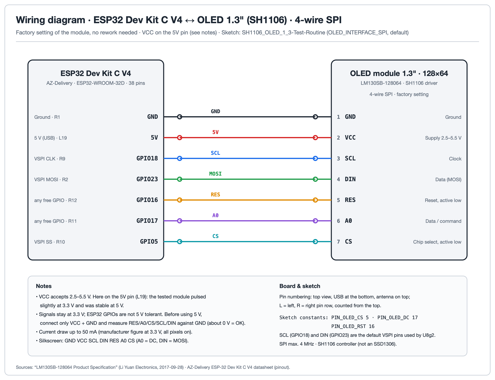
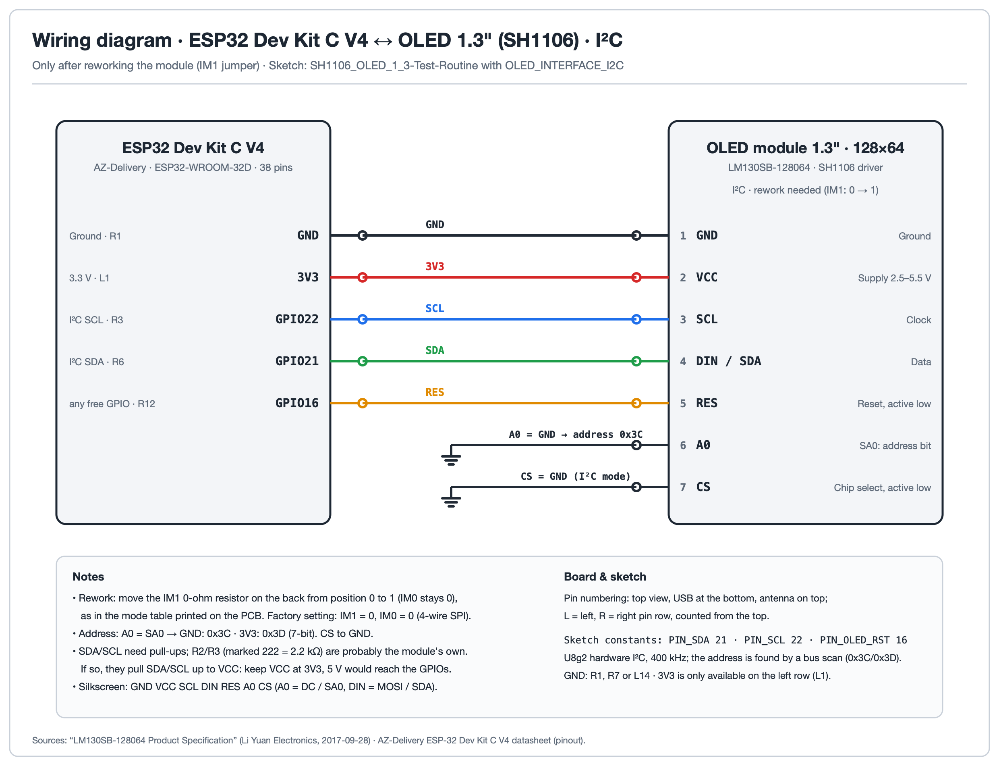

# SH1106 OLED 1.3" Module for ESP32

Test sketch for the 1.3" **128x64 SH1106 OLED module** (7 pins, 4-wire SPI or I2C) on an ESP32. It uses the [U8g2](https://github.com/olikraus/u8g2) library and runs 17 tests that show what the display and the library can do. Where to buy: [tinkerberg.com](https://www.tinkerberg.com).

---

## What it does

Each run starts with the logo for 5 seconds, then shows the `128x64` resolution screen, then works through all tests below in an endless loop. Every step is also printed on the serial console (115200 baud).

| # | Test | What it shows |
|:---:|:---|:---|
| 1 | Resolution | Border, both diagonals and a centred `128x64` label |
| 2 | All pixels off/on | Blank, then fully lit panel |
| 3 | Checkerboard | Single-pixel and 8x8 checkerboards, inverted phases |
| 4 | Fonts | Fixed, sans-serif, serif and monospaced fonts, plus a live `mm:ss` clock in a 32 px font |
| 5 | UTF-8 and symbols | Umlauts, euro, degree, arrows, check mark, star, heart, sun, cloud |
| 6 | Icons | 8 large and 18 small icons from the Open Iconic font |
| 7 | Text directions | Text drawn at 0, 90, 180 and 270 degrees |
| 8 | Graphics primitives | Lines, frames, boxes, circles, discs, rounded frames, triangles, ellipses |
| 9 | XOR drawing mode | Overlapping shapes and text that invert what is underneath |
| 10 | Bitmap | 16x16 XBM heart, normal and inverted |
| 11 | Hardware invert | Controller-side invert command, toggled four times |
| 12 | Contrast 0..255 | Contrast sweep up and down |
| 13 | Software scrolling | Horizontal and vertical text scrolling |
| 14 | Rotation 0..3 | The four `setDisplayRotation()` orientations |
| 15 | Display on/off | Power save on and off; RAM content stays |
| 16 | Bus speed | Measured frame transfer time, maximum frame rate and bus clock |
| 17 | Animation / FPS | A bouncing dot and the frame rate it reaches |

---

## Hardware

**Module:** 1.3" OLED, 128x64 pixels, SH1106 controller, 7 pins (`GND VCC SCL DIN RES A0 CS`; A0 = DC, DIN = MOSI/SDA). Supply 2.5-5.5 V.

**Board:** the wiring below is for the AZ-Delivery ESP32 Dev Kit C V4 (38 pins). Any other ESP32 board works the same way with the GPIO numbers given.

**SH1106 is not an SSD1306.** The module uses an SH1106 with a 132-column RAM. Driving it with an SSD1306 driver shifts the image by 2 pixels and leaves noise on the edge. This sketch selects U8g2's SH1106 driver.

### Wiring - 4-wire SPI (default)

4-wire SPI is the factory setting of the module. GND can be any GND pin of the board; 3V3 exists only on the left pin row.

| Module | ESP32 | Note |
|:---:|:---:|:---|
| GND | GND | |
| VCC | 5V | see [Supply voltage](#supply-voltage) |
| SCL | GPIO18 | VSPI clock, fixed |
| DIN | GPIO23 | VSPI MOSI, fixed |
| RES | GPIO16 | any free GPIO |
| A0 | GPIO17 | A0 = DC, any free GPIO |
| CS | GPIO5 | any free GPIO |

To use other pins for RES, A0 and CS, change `PIN_OLED_RST`, `PIN_OLED_DC` and `PIN_OLED_CS` at the top of the sketch. The hardware SPI constructor always uses the default VSPI pins for clock and data; to move those too, switch to U8g2's software SPI constructor (`U8G2_SH1106_128X64_NONAME_F_4W_SW_SPI`).

### Wiring - I2C (optional)

The interface is set by the two solder jumpers IM1 and IM0 on the back of the module; the mode table is printed on the PCB. Factory setting is 4-wire SPI (IM1 = 0, IM0 = 0). I2C needs IM1 = 1 and IM0 = 0, i.e. move only the IM1 0-ohm resistor from position 0 to 1. Then change the default of `OLED_INTERFACE` at the top of the sketch to `OLED_INTERFACE_I2C`.

| Module | ESP32 | Note |
|:---:|:---:|:---|
| GND | GND | |
| VCC | 3V3 | see [Supply voltage](#supply-voltage) |
| SCL | GPIO22 | I2C SCL |
| DIN | GPIO21 | I2C SDA |
| RES | GPIO16 | do not leave floating |
| A0 | GND | address 0x3C (3V3 = 0x3D) |
| CS | GND | required in I2C mode |

The sketch scans the bus and uses the address it finds.

The module can also be set to 3-wire SPI (IM1 = 0, IM0 = 1); the sketch does not cover that mode.

---

## Requirements

- Arduino IDE 2.x
- ESP32 board package (Boards Manager: *esp32* by Espressif)
- Library **U8g2** (Library Manager)

Built with U8g2 2.36.18 and Arduino-ESP32 2.0.17.

---

## Installation & Usage

1. Open `SH1106_OLED_1_3-Test-Routine/SH1106_OLED_1_3-Test-Routine.ino` in the Arduino IDE (the file must stay in a folder of the same name, next to `tinkerberg_logo.h`).
2. Select **Tools > Board > ESP32 Dev Module** and choose the port.
3. Upload - hold **BOOT** if it stalls at `Connecting....`
4. Open the Serial Monitor at **115200 baud**; every test is logged as `[n/17] name`.

---

## Notes

### Supply voltage

The module accepts 2.5-5.5 V. The tested module pulsed slightly at 3.3 V (in SPI mode) and ran steady from the 5V pin. Before using 5 V, connect only VCC and GND and measure the signal pins against GND: none of them may show about 5 V (a pull-up to VCC), because ESP32 GPIOs are not 5 V tolerant.

In I2C mode this matters most: the ESP32 releases SDA and SCL, so any pull-up to VCC ends up on the pins. The module carries two resistors marked 222 (2.2 kOhm) that are probably its I2C pull-ups, so use 3V3 there unless the measurement shows otherwise.

### Brightness depends on the picture

These are passive-matrix OLEDs: the rows are driven one after another (1/64 multiplexing), and the more pixels of a row are lit, the more the brightness drops. You can see it in *All pixels on* and the checkerboard test. It is normal panel behaviour, not a defect; it is much more noticeable on this 1.3" panel (up to 50 mA) than on a 0.96" one.

### Rolling bars in photos and video

They come from the camera shutter beating against the panel's row scan. A different exposure time usually helps.

### Logo

`tinkerberg_logo.h` holds the start-up logo as a 122x24 XBM bitmap (LSB first, rows padded to whole bytes). It is a brand asset: replace it with your own logo, or drop the `showLogo()` call, when you build on this sketch.

---

## Files

| File | Description |
|:---|:---|
| `SH1106_OLED_1_3-Test-Routine/SH1106_OLED_1_3-Test-Routine.ino` | Test sketch (SPI default, I2C optional) |
| `SH1106_OLED_1_3-Test-Routine/tinkerberg_logo.h` | Start-up logo as XBM bitmap |
| `docs/` | Wiring diagrams |
| `LICENSE` | MIT license |

---

## Author

**Stefan Graf** · [shop@tinkerberg.com](mailto:shop@tinkerberg.com) · [tinkerberg.com](https://www.tinkerberg.com) · [github.com/graflichttechnik](https://github.com/graflichttechnik)

---

## License

MIT - see [LICENSE](LICENSE). U8g2 is a separate project under its own license (BSD-2-Clause for the library; its fonts carry their own licenses); it is not included in this repository.

---

## Related

- [U8g2](https://github.com/olikraus/u8g2) - the graphics library used here
- [tinkerberg.com](https://www.tinkerberg.com) - shop
